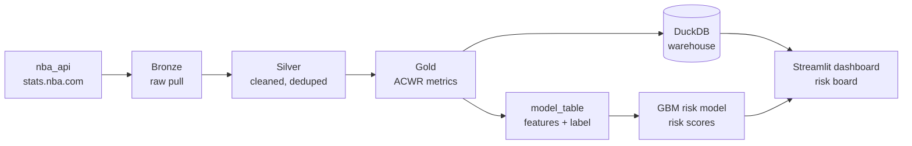

# NBA Player Load & Injury-Risk Intelligence Platform

An end-to-end data platform that ingests NBA game data for all 30 teams,
engineers a domain-informed **player-load** metric, predicts near-term
**absence risk** with a machine-learning model, and serves it all through a
live decision dashboard — orchestrated and scheduled like a production system.

**Live dashboard:** https://calvin-nba-load.streamlit.app/

**Stack:** Python · pandas · scikit-learn · DuckDB · Dagster · Streamlit · Plotly

---

## What it answers

> How does accumulated physical load affect an NBA player, and can we predict
> when one is heading toward a fatigue-driven absence — early enough to rest them?

## Architecture

Orchestrated by **Dagster** as an asset graph with data-quality checks and a nightly schedule.

## The load metric (ACWR)

The core feature is the **Acute:Chronic Workload Ratio** — a real
sports-science measure comparing short-term load (7-day) to a rolling baseline
(28-day), computed on a daily calendar per player. Two refinements make the
labels trustworthy:

- **Stint-based warm-up** — ACWR is only trusted after a full 28-day window of
  continuous play since a player's last real break (offseason *or* mid-season
  injury), so season openers and return-from-injury games aren't false-flagged.
- **Exposure gating** — games without enough recent play in the chronic window
  are marked insufficient_history rather than assigned a meaningless ratio.

## The model

Predicts whether a player is about to miss significant time (an injury/DNP
proxy: a gap of 5+ days to their next game).

- **Leakage-free, time-based split** — trained on earlier seasons, tested on
  the latest. Never a random split, which would leak future games for a time series.
- **Baseline vs. boosting** — logistic regression benchmarked against a
  histogram gradient-boosting classifier, so the lift is explicit.
- **Judged on PR-AUC vs. the base rate**, not accuracy, because absences are a
  ~10% minority class.

**Results (test on 2025-26):**

| model             | ROC-AUC | PR-AUC | vs. base rate |
|-------------------|:-------:|:------:|:-------------:|
| logistic baseline |  0.68   |  0.23  |     +0.14     |
| gradient boosting |  0.70   |  0.25  |     +0.15     |

PR-AUC of 0.25 is about 2.6x the 9.7% base rate — a genuinely-better-than-chance
model on a hard problem, with permutation importance surfacing recent minutes
load and cumulative season volume as top predictors. Honest and real, not an
overfit 0.95.

## The dashboard

A Streamlit app (deployed on Streamlit Cloud) with cascading
**Season / Team / Player** filters, a **model-driven risk board** ranking
every player by predicted absence probability, per-player ACWR trends with
sweet-spot and danger bands, and the league-wide load distribution.

## Orchestration

The pipeline is a Dagster **asset graph** — bronze to silver to gold to
warehouse, plus the feature table and model — with:

- **Data-quality checks** on the gold layer (no null player keys, ACWR in range)
- A **nightly schedule** that re-runs the whole graph
- **Auto-advancing seasons** — the season list is computed from the date, so
  the platform pulls the current season automatically without code changes

## Running it

Install, then run the pipeline stages in order:

    python -m venv .venv && source .venv/bin/activate
    pip install -r requirements.txt

    python -m src.pipeline                 # ingest -> clean -> ACWR -> warehouse
    python -m src.ingest.player_bio        # age/height/weight
    python -m src.features.build_features  # feature + label table
    python -m src.model.train              # train + evaluate (writes reports/)
    python -m src.model.score              # per-player risk scores

    streamlit run dashboard/app.py         # dashboard at localhost:8501
    dagster dev -f orchestration/definitions.py   # UI at localhost:3000

## Roadmap / honest limitations

- **Label is a proxy.** "Gap to next game" captures injuries but also rest,
  DNPs, and trades. Swapping in real injury data is the highest-leverage next
  improvement.
- **Load = minutes only.** Adding tracking data (distance, average speed) would
  give a truer physical-load signal.
- **Incremental ingestion.** Each run re-pulls full seasons; production would
  fetch only new games.
- **Always-on scheduling.** The nightly schedule runs while the Dagster daemon
  is up; a cloud deployment would make it truly continuous.
